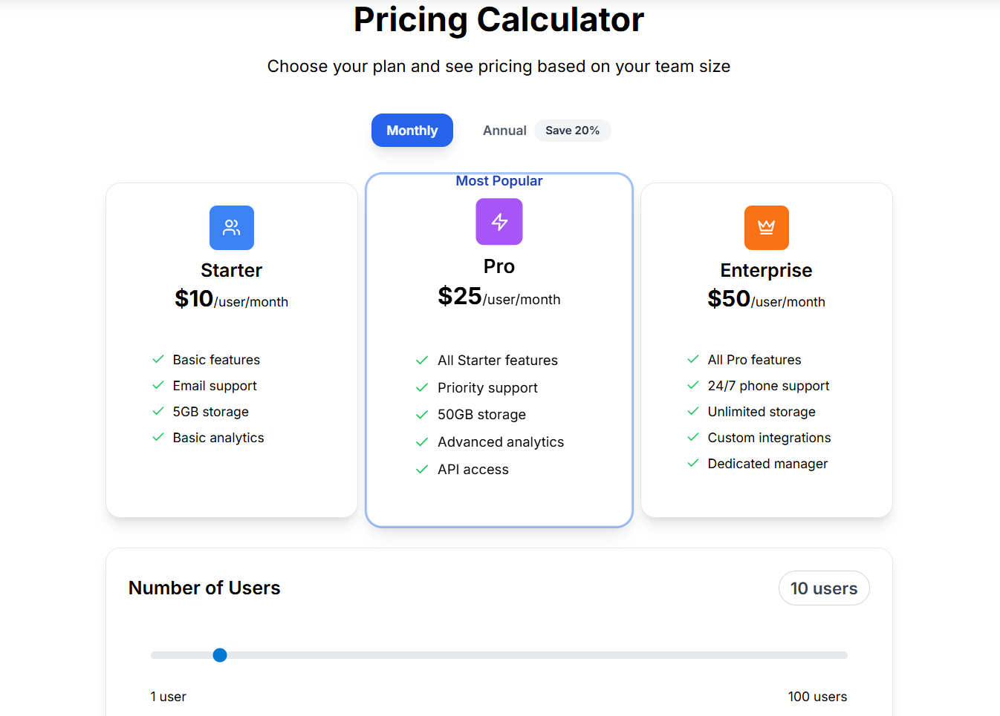
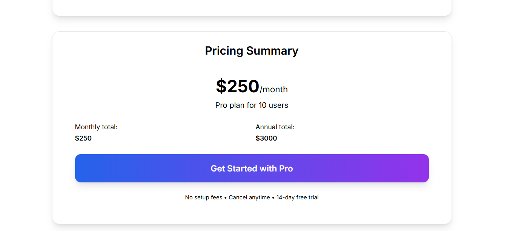
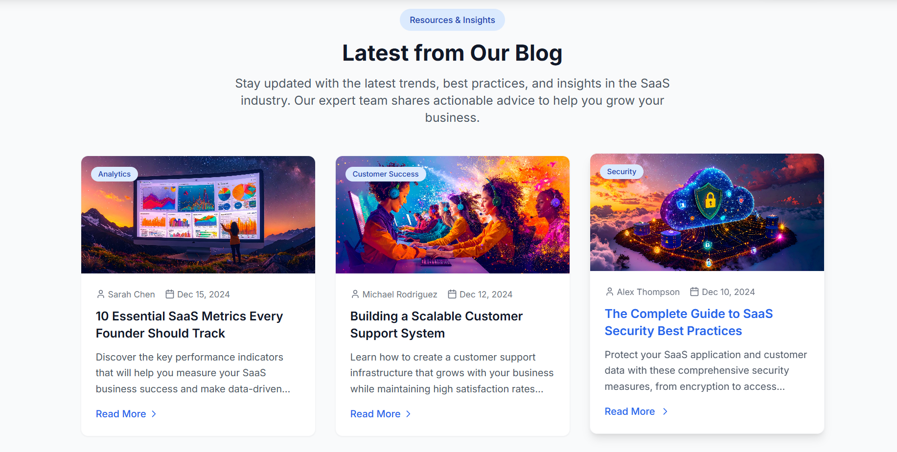

# ADmyBRAND AI Suite – Modern SaaS Landing Page

A beautiful, responsive landing page built for **ADmyBRAND AI Suite**, designed using modern UI/UX patterns and accelerated with AI-powered coding tools.

---

## 🚀 Features

- 🎯 **Hero Section** with glassmorphism badge, animated icons, and autoplay background video
- ✨ **Features Section** with six feature blocks using iconography
- 💰 **Interactive Pricing Calculator** with real-time tier comparison
- 🧠 **Testimonials Carousel** for social proof
- ❓ **FAQ Section** with collapsible elements
- 📖 **Blog Section** with cards, authorship, and responsive layout
- 🧾 **Footer** with links, contact, and social media

---

## 🖼 Screenshots






---

## 🧱 Tech Stack

- **Framework:** [Next.js 14](https://nextjs.org/)
- **Language:** TypeScript
- **Styling:** Tailwind CSS
- **Component Design:** Modular + Reusable
- **Animations:** CSS + Framer Motion-ready
- **Deployment:** [Vercel](https://vercel.com)

---

## 🧠 AI Usage Report

See [`AI_USAGE_REPORT.md`](./AI_USAGE_REPORT.md) for details on AI tools, prompts, and manual vs AI split.

---

## 📂 Project Structure

```
.
├── .bolt/                                               # Bolt configuration
├── public/
│ └── assets/                                            # Static assets like landing page images
├── src/ # Main source code
│ ├── components/                                        # Reusable UI components and sections
│ │ ├── forms/
│ │ │ └── ContactForm.tsx                                # Contact form component
│ │ ├── sections/
│ │ │ ├── BlogSection.tsx
│ │ │ ├── FAQSection.tsx
│ │ │ ├── FeaturesSection.tsx
│ │ │ ├── Footer.tsx
│ │ │ ├── HeroSection.tsx
│ │ │ ├── PricingSection.tsx
│ │ │ └── TestimonialsSection.tsx
│ │ ├── ui/
│ │ │ ├── Accordion.tsx
│ │ │ ├── Badge.tsx
│ │ │ ├── BlogCard.tsx
│ │ │ ├── Button.tsx
│ │ │ ├── Card.tsx
│ │ │ ├── Carousel.tsx
│ │ │ ├── Input.tsx
│ │ │ ├── Modal.tsx
│ │ │ ├── Navbar.tsx
│ │ │ └── Slider.tsx
│ │ └── utils/
│ │ └── cn.ts                                                   # Class name utility function
│ ├── hooks/
│ │ └── useScrollAnimation.ts                                   # Custom scroll animation hook
│ ├── App.tsx # Root React component
│ ├── main.tsx # Entry point for Vite
│ ├── index.css # Global styles
│ └── vite-env.d.ts # TypeScript environment definitions
├── .gitignore
├── README.md
├── index.html                                                   # HTML template
├── package.json                                                 # Project metadata and scripts
├── package-lock.json                                            # Lock file
├── postcss.config.js                                            # PostCSS configuration
├── tailwind.config.js                                           # Tailwind CSS configuration
├── eslint.config.js                                             # ESLint configuration
├── tsconfig.json                                                # TypeScript base config
├── tsconfig.app.json                                            # TypeScript config for app
├── tsconfig.node.json                                           # TypeScript config for node
└── vite.config.ts                                               # Vite configuration
```

## 📦 Getting Started

### 1. Clone the Repository

```bash
git clone https://github.com/your-username/admybrand-landing.git
cd admybrand-landing
```
### 2. Install Dependencies
```bash
npm install
```
### 3. Run Locally
```bash
npm run dev
```

Visit `http://localhost:5173` in your browser.
