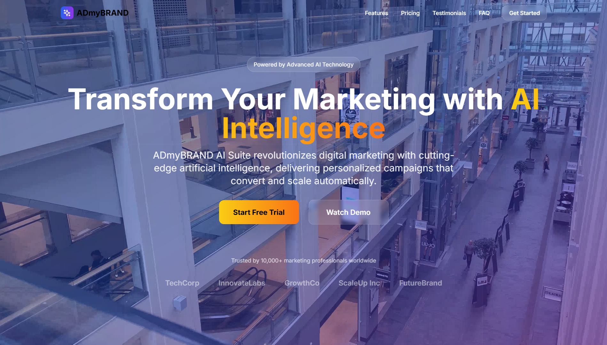

# ADmyBRAND AI Suite – Modern SaaS Landing Page

A beautiful, responsive landing page built for **ADmyBRAND AI Suite**, designed using modern UI/UX patterns and accelerated with AI-powered coding tools.

---

## 🚀 Features

- 🎯 **Hero Section** with glassmorphism badge, animated icons, and autoplay background video
- ✨ **Features Section** with six feature blocks using iconography
- 💰 **Interactive Pricing Calculator** with real-time tier comparison
- 🧠 **Testimonials Carousel** for social proof
- ❓ **FAQ Section** with collapsible elements
- 📖 **Blog Section** with cards, authorship, and responsive layout
- 🧾 **Footer** with links, contact, and social media

---

## 🖼 Screenshots

---

## 🧱 Tech Stack

- **Framework:** [Next.js 14](https://nextjs.org/)
- **Language:** TypeScript
- **Styling:** Tailwind CSS
- **Component Design:** Modular + Reusable
- **Animations:** CSS + Framer Motion-ready
- **Deployment:** [Vercel](https://vercel.com)

---

## 📁 Folder Structure (Simplified)

